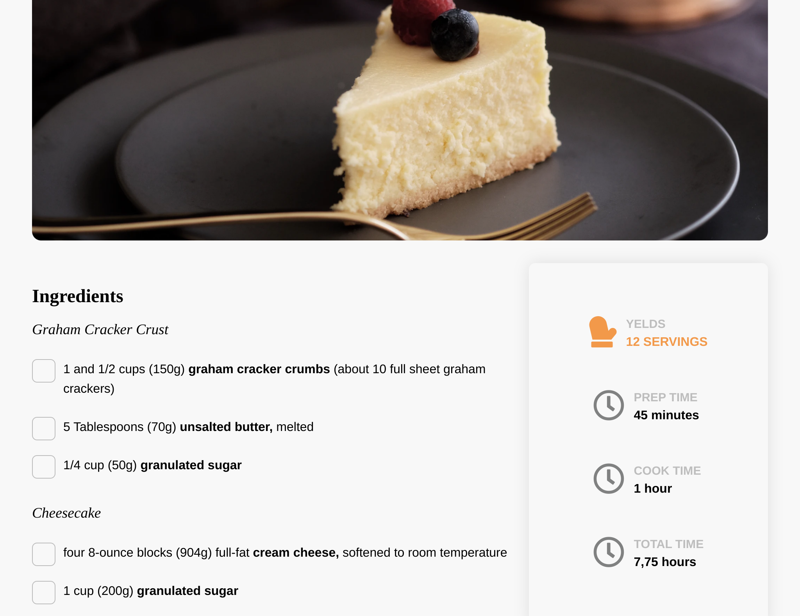

<h1 align="center">Recipe page</h1>

   Solution for a challenge from  <a href="http://devchallenges.io" target="_blank">Devchallenges.io</a>.

  <h3>
    <a href="https://{your-demo-link.your-domain}">
      Demo
    </a>
     | 
    <a href="https://{your-url-to-the-solution}">
      Solution
    </a>
     | 
    <a href="https://{your-url-to-the-challenge}">
      Challenge
    </a>
  </h3>

<!-- OVERVIEW -->

## Overview

### Built With

- Html
- Css

## Features

This application/site was created as a submission to a [DevChallenges](https://devchallenges.io/challenges) challenge. The [challenge](https://devchallenges.io/challenges/TtUjDt19eIHxNQ4n5jps) was to build an application to complete the following user stories:

- [x] User story: This is a completed user stories
- [ ] User story: This is a incompleted user stories
- [ ] User story: This is a incompleted 2nd user stories

## Contact

- GitHub [malins-cyber](https://{github.com/malins-cyber})
